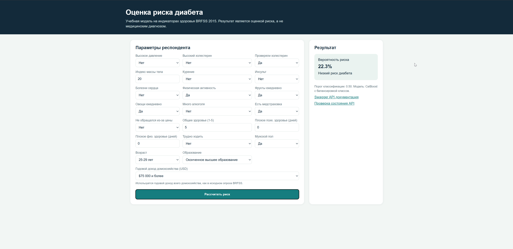
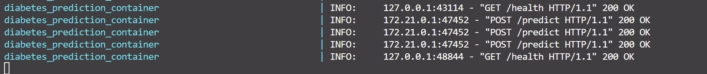

# Предсказание риска диабета по индикаторам здоровья

**Студент:** Курило Илья Константинович
**Группа:** БИВ231

## 1. Введение и постановка задачи

Цель проекта - по ответам респондента о здоровье и образе жизни оценить
наличие риска диабета. Такой сервис можно использовать для предварительного
скрининга: он не ставит диагноз, но позволяет обратить внимание пользователя
на необходимость консультации с врачом.

В исходном датасете целевая переменная имеет три значения:

- `0` - диабета нет;
- `1` - преддиабет;
- `2` - диабет.

В проекте решается задача бинарной классификации: классы 1 и 2
объединены в класс риска, а 0 остается отрицательным классом. Это удобно для
интерфейса: пользователю сообщается, найден ли повышенный риск.

Основные метрики - F1-score положительного класса и ROC-AUC. F1 учитывает одновременно precision и recall положительного класса, а ROC-AUC
показывает способность модели ранжировать объекты по вероятности риска.

## 2. Поиск и описание данных

Использован датасет
[Diabetes Health Indicators Dataset](https://www.kaggle.com/datasets/alexteboul/diabetes-health-indicators-dataset/data),
построенный на данных опроса CDC BRFSS 2015. Для работы выбран файл
`diabetes_012_health_indicators_BRFSS2015.csv`, поскольку в нем сохранены три
исходные категории целевой переменной.

По результатам EDA в ноутбуке `notebooks/01_eda.ipynb`:

| Характеристика | Значение |
|---|---:|
| Количество строк | 253680 |
| Количество столбцов | 22 |
| Количество признаков без цели | 21 |
| Пропущенные значения | 0 |
| Полные дубликаты строк | 23899 (9.42%) |

Распределение исходной цели:

| Класс | Смысл | Доля |
|---:|---|---:|
| 0 | Нет диабета | 84.24% |
| 1 | Преддиабет | 1.83% |
| 2 | Диабет | 13.93% |


## 3. Обработка и подготовка данных

В данных не обнаружено пропущенных значений, поэтому заполнение пропусков не
проводилось. Полные совпадения строк не удалялись: это результаты анонимного
опроса, и без идентификатора респондента одинаковые ответы могут принадлежать
разным людям.

Подготовка данных состояла из следующих шагов:

1. Целевая переменная преобразована в бинарную: 0 = 0, 1 и 2 = 1.
2. В модель передаются все 21 исходных признака без создания дополнительных
   признаков.
3. Для экспериментов выполнено стратифицированное разбиение с
   random_state=777: 70% train, 15% validation, 15% test.

| Часть | Строк | Положительный класс |
|---|---:|---:|
| Train | 177576 | 27984 |
| Validation | 38052 | 5996 |
| Test | 38052 | 5997 |

Разделение выполнено до обучения моделей, что исключает утечку целевого признака между train и validation/test.

## 4. Baseline-модель

В качестве baseline использована логистическая регрессия. Перед обучением
признаки масштабировались через StandardScaler, а для компенсации дисбаланса
классов использовался параметр class_weight="balanced".

Результаты baseline на validation:

| Модель | F1-score класса риска | ROC-AUC | Recall класса риска | Accuracy |
|---|---:|---:|---:|---:|
| Logistic Regression | 0.4700 | 0.8177 | 0.76 | 0.73 |

Baseline показывает, что по анкетным признакам можно выделять группу риска,
но precision положительного класса остается невысоким (0.34). Для задачи
скрининга повышенный recall полезен, поскольку пропуск риска нежелателен.

## 5. Эксперименты

Эксперименты выполнены в `notebooks/03_experiments.ipynb` на том же
стратифицированном разбиении данных.

| Модель | Гипотеза | Как проверялось | F1-score | ROC-AUC в ноутбуке | Результат |
|---|---|---|---:|---:|---|
| Random Forest | Деревья найдут нелинейные зависимости | n_estimators=100, class_weight="balanced" | 0.2679 | 0.5740 | Существенно хуже |
| XGBoost | Бустинг повысит качество редкого класса | 100 деревьев, balanced sample weights | 0.4671 | 0.7416 | Близко к baseline |
| CatBoost | Бустинг стабильно обработает неоднородные признаки | 500 итераций, auto_class_weights="Balanced" | 0.4696 | 0.7432 | Выбран для сервиса |
| LightGBM tuned | Подбор параметров улучшит бустинг | RandomizedSearchCV, 5 комбинаций, 3-fold CV | 0.4687 | 0.7468 | Не лучше CatBoost по F1 |
| Stacking Ensemble | Ансамбль повысит F1 | RF + XGBoost + CatBoost, meta-model LR | 0.3157 | 0.5937 | Качество ухудшилось |

CatBoost выбран финальной экспериментальной моделью: среди обученных
бустингов он показал лучший F1 и при этом требует мало дополнительной
подготовки признаков. Его удобно сохранить и использовать в API.

## 6. Финальная модель и интерпретируемость результатов

Финальная модель, подключенная к сервису:

```python
CatBoostClassifier(
    iterations=500,
    random_seed=777,
    auto_class_weights="Balanced",
    verbose=0
)
```

После выбора модели она обучена на полном доступном датасете и сохранена в
файл models/diabetes_catboost.cbm. Этот файл загружается при старте API.

Важности признаков сохраненной финальной модели:

| Признак | Важность |
|---|---:|
| BMI | 17.53 |
| Age | 16.08 |
| GenHlth | 15.79 |
| Income | 6.86 |
| HighBP | 6.65 |
| HighChol | 5.04 |
| MentHlth | 4.98 |
| PhysHlth | 4.35 |
| Education | 4.05 |
| CholCheck | 3.28 |

Самый большой вклад в предсказания модели вносят индекс массы тела, возраст
и субъективная оценка общего здоровья.

## 7. Деплой

Для демонстрации модели реализован сервис на FastAPI.
Пользователь выбирает или вводит все 21 характеристики, после чего форма
отправляет JSON-запрос в API и показывает вероятность риска.

Запуск сервиса:

```bash
docker compose up --build
```

Эндпоинты:

| Метод и URL | Назначение |
|---|---|
| `GET /` | Веб-форма для ручного ввода характеристик |
| `POST /predict` | Получение прогноза в JSON |
| `GET /health` | Проверка загрузки CatBoost-модели |
| `GET /docs` | Swagger-документация FastAPI |

Пример ответа `POST /predict`:

```json
{
  "prediction": 1,
  "label": "Есть риск диабета",
  "risk_probability": 0.8565,
  "threshold": 0.5
}
```

Скриншот работающего интерфейса:






[Ссылка на видео демонстрации](https://drive.google.com/file/d/18pep0edb7-csY9XygtKOvXa5-0tgolm6/view?usp=sharing)

## 8. Заключение и выводы

В проекте подготовлен датасет BRFSS 2015 для задачи бинарной оценки риска
диабета, построен baseline и проверены несколько моделей машинного обучения.
Для пользовательского сервиса выбрана CatBoost-модель с балансировкой классов,
сохраненная в отдельный артефакт и подключенная к FastAPI.

Результатом проекта является рабочее приложение: пользователь заполняет
понятную форму, сервис отправляет все необходимые характеристики в модель и
отображает оценку риска. Основные ограничения проекта - дисбаланс классов,
опросный характер данных. Возможные улучшения - настройка порога
под требования скрининга и проверка качества модели на данных другого года.
